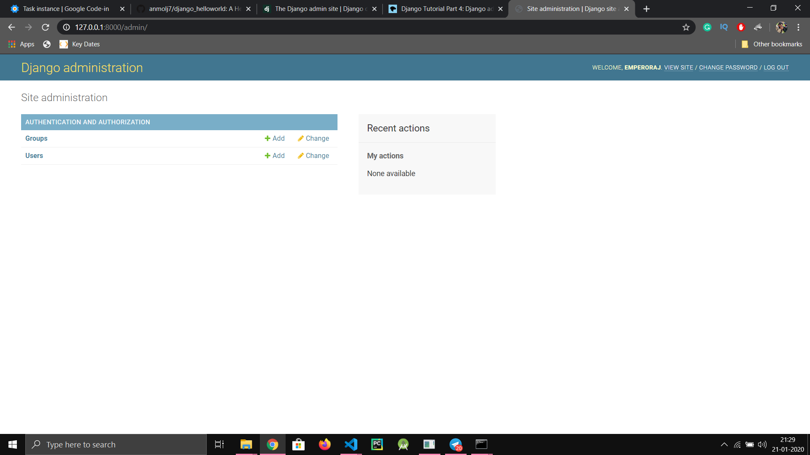

# django_helloworld
A HelloWorld django task for GCI

# To run the server
```console
$ cd hello_world
$ python3 -m pip install -r requirements.txt
$ python3 manage.py runserver
```

# Steps To Create a super user.
Creating a super user is super easy! All you have to do is run the following command, and enter the asked details, i.e Username, Email, password, password confirmation, and VOILA!!
```console
$ python3 manage.py createsuperuser
```

# Screenshots
